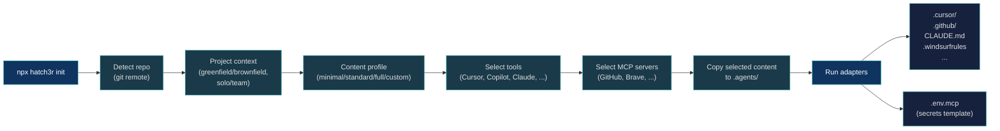
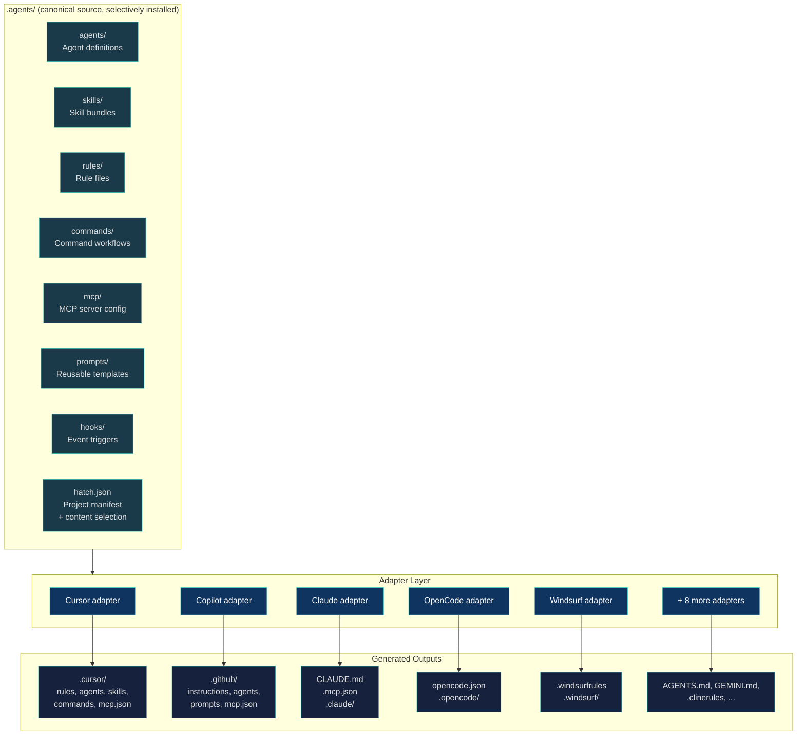
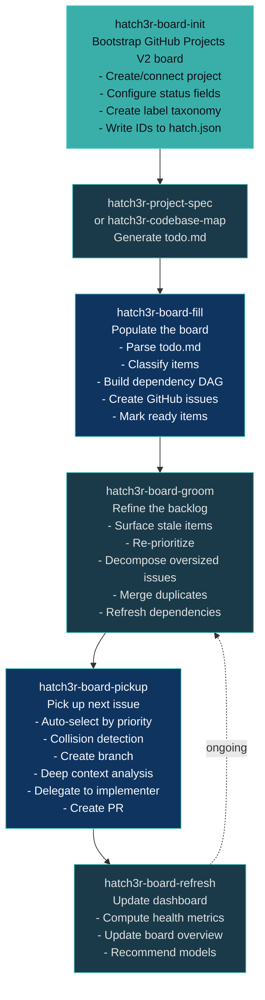
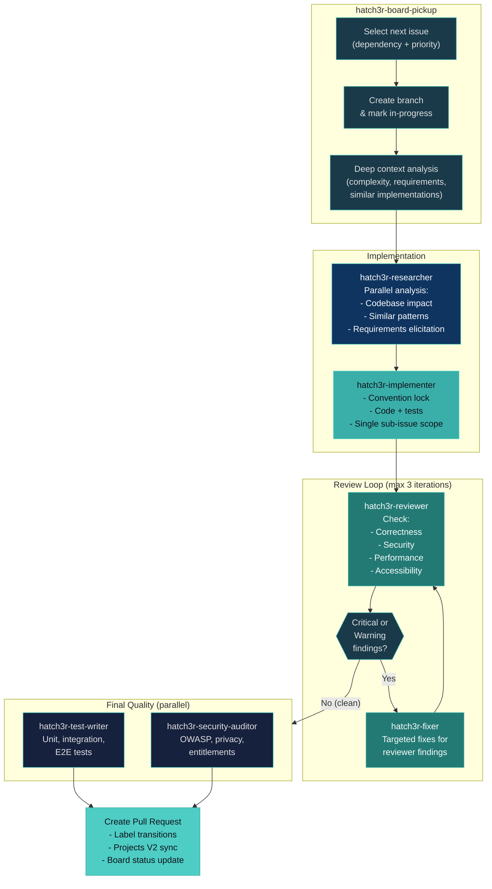
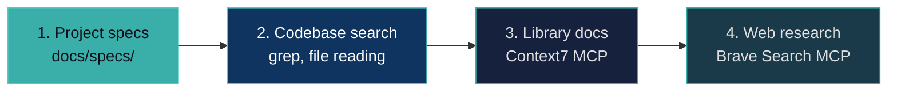

# Agentic Process

Visual guide to hatch3r's agentic workflow -- from initialization to board-driven development.

## Init Flow

How `npx hatch3r init` sets up a project:

## Canonical Content Model

One source of truth generates outputs for all tools:

## Board Workflow

The full board-driven development lifecycle:

## Agent Orchestration

How agents collaborate during `hatch3r-board-pickup` and the review pipeline:

## Tooling Hierarchy

How agents prioritize information sources:

For a text-based description of these patterns, see [Sub-Agentic Architecture](sub-agentic-architecture).
